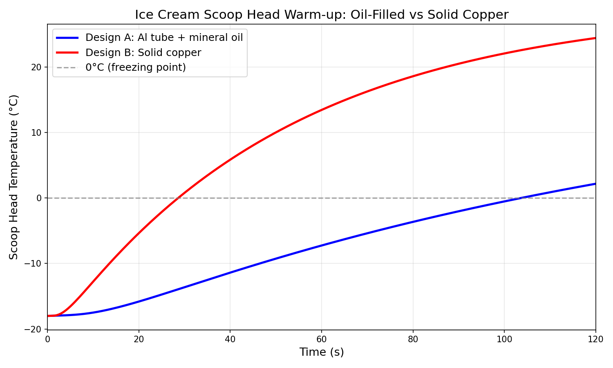
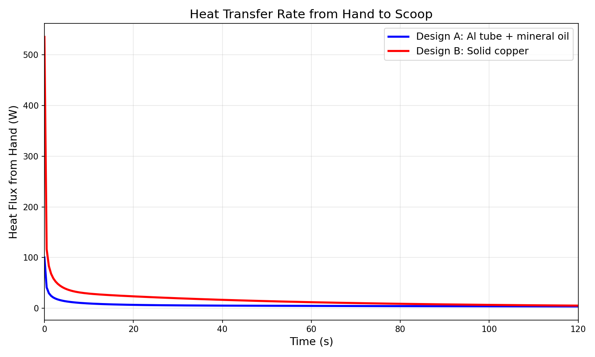
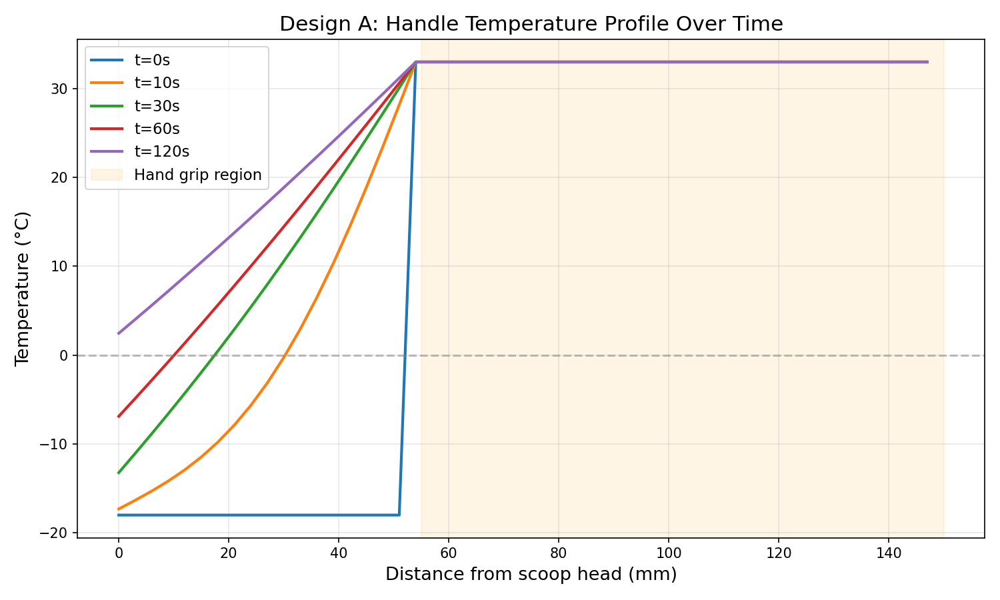
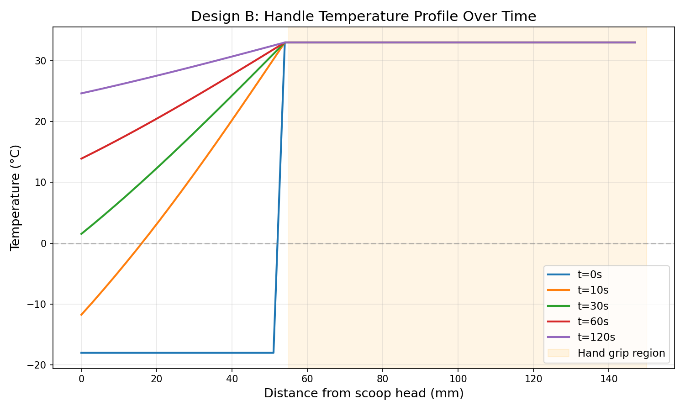

# 🍦 Ice Cream Scoop Thermal CFD Comparison

Open-source thermal simulation comparing two ice cream scoop handle designs:

- **Design A:** Aluminum tube with mineral oil fill (heat-conductive fluid) — the classic Zeroll-style design
- **Design B:** Solid copper handle — the theoretical optimum

## Why?

A [discussion](https://x.com/jerclaw) about identifying an unbranded ice cream scoop led to the question: *how much better would a solid copper scoop actually be?* This simulation answers that with real physics.

## Methodology

### Solver
Quasi-1D transient thermal model using explicit finite-difference for axial conduction along the handle, with a lumped-capacitance model for the scoop head.

### Heat equation (cylindrical coords, axial only):
```
∂T/∂t = α · ∂²T/∂z²
```

Where `α = k_eff / (ρ · cp)` accounts for the composite cross-section (aluminum wall + oil core in parallel for Design A).

### Geometry
| Parameter | Value |
|-----------|-------|
| Handle length | 150 mm |
| Handle outer radius | 10 mm |
| Handle inner radius (oil core) | 8 mm |
| Scoop head radius | 25 mm |
| Scoop head thickness | 4 mm |
| Hand grip length | 95 mm |

### Material Properties
| Material | k (W/m·K) | ρ (kg/m³) | cp (J/kg·K) |
|----------|-----------|-----------|-------------|
| Aluminum | 205 | 2700 | 900 |
| Copper | 401 | 8960 | 385 |
| Mineral oil (effective) | 2.0 | 850 | 2000 |

The oil effective conductivity of 2.0 W/m·K accounts for natural convection within the sealed tube (Rayleigh number analysis suggests Nu ≈ 3-5 for this geometry).

### Boundary Conditions
- **Hand grip region:** Fixed at 33°C (palm temperature)
- **Scoop head bottom:** Contact with ice cream at -18°C (convective, h=20 W/m²K)
- **Exposed surfaces:** Ambient convection, h=10 W/m²K, T_amb=22°C
- **Initial condition:** Entire scoop at -18°C (fresh from freezer)

### Grid & Stability
- 50 axial segments (dz = 3 mm)
- dt = 10 ms (Fourier number < 0.4)
- Simulated 120 seconds (12,000 steps)

## Results

### Key Findings

| Metric | Design A (Oil-filled Al) | Design B (Solid Cu) | Ratio |
|--------|--------------------------|---------------------|-------|
| **Time to 0°C** | ~104 s | ~29 s | **3.6× faster** |
| **Peak heat flux** | ~100 W | ~535 W | 5.3× |
| **Steady-state flux** | ~3.5 W | ~5.2 W | 1.5× |
| **Temp at 120s** | 2.2°C | 24.4°C | — |

### Temperature Evolution


### Heat Flux from Hand


### Handle Temperature Profiles

**Design A (Aluminum + Oil):**


**Design B (Solid Copper):**


## Interpretation

Copper conducts heat **3.6× faster** to the scoop head, reaching 0°C in under 30 seconds vs 104 seconds for the oil-filled design. The copper scoop continues warming well past 0°C, reaching ~24°C after 2 minutes.

However, copper has significant practical disadvantages:
- **Weight:** ~70g head vs ~21g (aluminum) — feels like a hammer
- **Cost:** Copper is expensive (~$15-20 in material alone)
- **Food safety:** Copper requires a food-safe coating (tin or stainless lining)
- **Corrosion:** Copper tarnishes and reacts with acidic foods

The oil-filled aluminum design is "good enough" — it reaches 0°C in ~104 seconds, which is adequate for scooping. The liquid-filled design wins on cost, weight, and food safety.

## Files

- `scoop_thermal_solver.py` — The solver (Python/NumPy)
- `results/` — Output data and plots
  - `head_temp_vs_time.png` — Main comparison plot
  - `heat_flux_vs_time.png` — Heat transfer comparison
  - `handle_profile_design_{A,B}.png` — Handle temperature profiles over time
  - `summary.json` — Machine-readable results
  - `*.npy` — Raw time-series data

## Reproducing

```bash
python3 scoop_thermal_solver.py
```

Requires: Python 3, NumPy, Matplotlib

## License

MIT — use this to build a better scoop. If you do, send us one.
